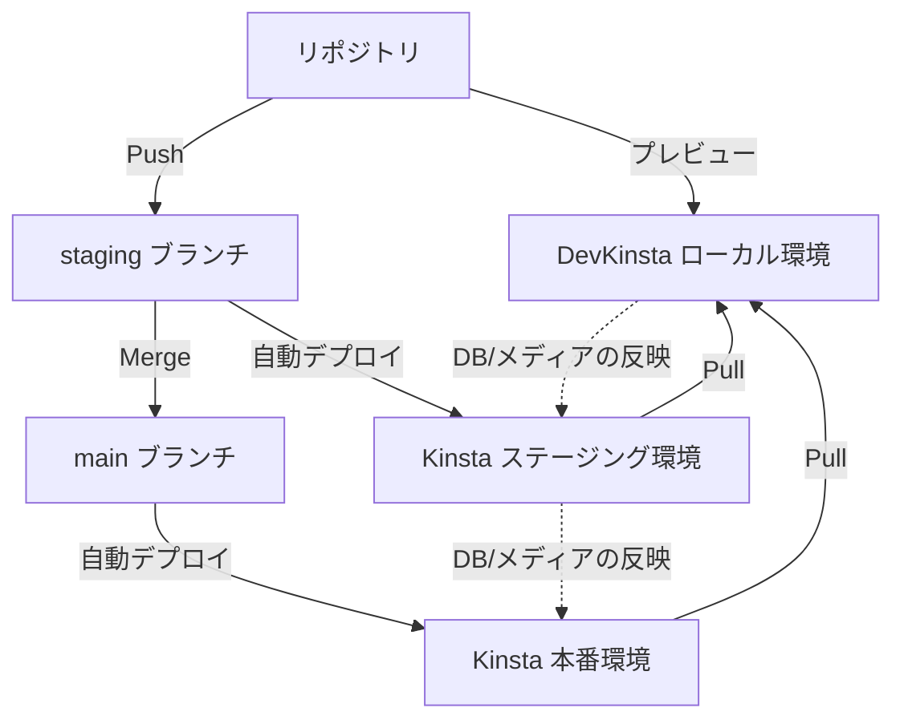

この記事は[ヌーラボブログリレー2025 冬 Tech](https://nulab.com/ja/blog/nulab/nulaber-blog-relay-2025-winter/)の15日目の記事です。

## はじめに

ここ一年ほど、WordPressのホスティングに[Kinsta](https://kinsta.com/jp/wordpress-hosting/)、ローカル開発に[DevKinsta](https://kinsta.com/jp/devkinsta/)を利用しています。

これらを導入するに当たって、各ツールの強みを活かすための開発フローを構築しました。今のところスムーズに運用できているのでまとめておこうと思います。

主なポイントは以下の2つです。

- **ローカル開発**： 開発中のWordPressテーマをDevKinstaでリアルタイムにプレビューするワークフローの構築
- **デプロイ**：GitリポジトリからKinstaサーバーへのデプロイフローの構築

一つの記事で両方を説明すると長くなるため、それぞれ記事を分けて解説していきます。当記事では**ローカル開発**に焦点を絞って解説します。

WordPressの開発フローに悩まれている方の参考になれば幸いです。Kinstaを前提としていますが、Kinsta以外に応用できる内容も含まれているはずです。

## 注意点

- 主にクラシックテーマの開発を想定して執筆しています。
- 開発環境の説明を主眼としています。テーマの作り方については触れません。
- 内容の誤り、説明が不十分な箇所、より適切なアプローチがあるかもしれません。気づいたらそっと教えていただけると幸いです。

## Kinsta、DevKinstaとは

[Kinsta](https://kinsta.com/jp/wordpress-hosting/)はWordPress専用のマネージドホスティングサービスです。
WordPressに関する調べ物をしているとKinstaのブログ記事をよく目にしますよね。これで存在を知った方も多いのではないでしょうか。

https://kinsta.com/jp/wordpress-hosting/

[DevKinsta](https://kinsta.com/jp/devkinsta/)はKinstaが提供しているWordPressのローカル開発ツールです。類似のサービスとしては[Local](https://localwp.com/)や[WordPress Studio](https://developer.wordpress.com/ja/studio/)があります。

DevKinstaはKinstaを契約していなくても利用可能です。ただしKinstaを利用している場合には、本番・ステージング環境との同期がワンクリックで行えるなど、非常に強力な機能が使えます。

https://kinsta.com/jp/devkinsta/

それぞれ詳細は割愛しますが、WordPressに必要な機能がオールインワンで揃っており、非常に優れたサービスだと感じています。開発者体験も上々です。
詳しく知りたい方は、以下の解説動画がとても分かりやすいのでぜひご覧ください。

https://www.youtube.com/playlist?list=PLh6V6_7fbbo-6Wc1lFrZ14Rb9HqL2HHHF

## 開発フローの全体像

Kinsta、DevKinstaを利用したWordPress開発・デプロイフローの全体像を示します。



1. DevKinstaを利用して、本番 or ステージング環境からローカル環境にサイトをPull
1. リポジトリとDevKinstaを連携。リポジトリでテーマを開発しながらローカル環境でプレビュー。**【本記事の対象はここ】**
1. stagingブランチにpush。自動でKinstaステージング環境にデプロイ
   - DBやメディアをローカルからステージングに反映したい場合はDevKinstaの「[同期](https://kinsta.com/jp/docs/devkinsta/devkinsta-integration/#mykinsta%E3%81%AE%E3%82%B9%E3%83%86%E3%83%BC%E3%82%B8%E3%83%B3%E3%82%B0%E7%92%B0%E5%A2%83%E3%81%AB%E5%A4%89%E6%9B%B4%E3%82%92%E5%8F%8D%E6%98%A0%E3%81%99%E3%82%8B)」を利用
1. mainブランチにmerge。自動でKinsta本番環境にデプロイ
   - DBやメディアをステージングから本番に反映したい場合はKinstaの「[環境の反映](https://kinsta.com/jp/docs/wordpress-hosting/wordpress-push-environments/)」を利用

:::message
当記事では2の**リポジトリとDevKinstaとの連携（ローカル開発）** に焦点を絞って解説します。

ステージング/本番へのデプロイフローについては別記事で解説します。
:::

## リポジトリで開発中のWordPressテーマをDevKinstaでリアルタイムプレビューする

前置きが長くなりましたが、ここから本題に入ります。

### DevKinstaの仕様

DevKinstaではワンクリックで簡単にWordPressのローカル環境を立ち上げたり、本番環境のクローンを作成することができます。


サイトを作成すると、PCのDevKinstaディレクトリ内にサイト専用のディレクトリが作成されます。
e.g., `Users/[user-name]/DevKinsta/public/[site-name]`


ディレクトリ内には、`wp-config.php`や`wp-content`など見慣れたWordPressのファイル群があります。

`wp-content/themes`にテーマディレクトリを配置すれば、DevKinstaのローカル環境に読み込まれすぐにプレビューできます。


しかし、変更のたびに手動でファイルをDevKinstaのディレクトリにコピーするのは非常に手間がかかります。

そこで、リポジトリからDevKinstaへ自動でファイルを同期したいと考えました。

### ローカル開発の全体像

アイデアはシンプルです。以下にイメージ図を示します。


1. リポジトリに`public`というディレクトリを作成。DevKinstaにアップするテーマファイル（PHPや各種アセット）を配置します。
2. ビルド・コンパイルなどの前処理が必要なファイル（CSS/JSなど）は `src`で開発し、Viteなどで `public`に出力します。
3. 独自スクリプト(`sync-public.js`)で、`public` ディレクトリの変更を監視し、変更があったらDevKinstaのディレクトリに同期（`rsync`）します。

リポジトリは以下のような構造になります。このうち`public`ディレクトリ内のファイル群がDevKinstaと同期されることになります。

```
.
├── package.json
├── public
│   └── wp-content
│       └── themes
│           └── my-theme
├── src
│   ├── css
│   └── js
└── sync-public.js
```

### テーマ開発の流れ

リポジトリでのテーマの開発方法について、特に縛りはありません。

重要なのは **`public`ディレクトリに最終成果物（テーマファイル）を設置すること**です。

私の場合、CSS/JSを`src`で開発し、Viteでwatchしつつ`public`配下のテーマディレクトリに出力するようにしています。PHPや画像などは`public`内に直接配置し、編集しています。

自分の場合はこうしているというだけなので、ここはそれぞれ好みの方法を選んで構いません。「Webpackを使いたい」「画像の一括処理をしたい」「Tailwindを使いたい」などの希望があればそのようにセットアップして問題ありません。

重要なのは最終的に`public` ディレクトリにサーバーへアップする全てのファイル群が出力されるようにすることです。

### 監視・同期スクリプト（`sync-public.js`）

DevKinstaとの連携の肝になるのが監視・同期用のスクリプト（ `sync-public.js`）です。
まずは以下に完成形を記載します。

```js:sync-public.js
import 'dotenv/config'; // .env から環境変数を読み込む
import { execa } from 'execa';
import chokidar from 'chokidar';

const rsyncDestinationPath = process.env.DEV_KINSTA_PUBLIC_PATH;
if (!rsyncDestinationPath) {
  console.error('エラー: 環境変数 DEV_KINSTA_PUBLIC_PATH が設定されていません。');
  console.error('.env ファイルに DEV_KINSTA_PUBLIC_PATH=/path/to/your/devkinsta/public/project を設定してください。');
  process.exit(1);
}

const rsyncCommand = 'rsync';
const rsyncArgs = [
  '-av',
  '--delete',
  '--exclude-from=public/.gitignore', // public/.gitignore を参照
  'public/', // 同期元
  rsyncDestinationPath // 同期先
];

let isRsyncing = false; // rsync実行中フラグ

// publicディレクトリの監視
const watcher = chokidar.watch('public', {
  persistent: true, // 変更を監視し続ける
  awaitWriteFinish: {
    stabilityThreshold: 2000, //この時間（ms）の間、ファイルサイズが変化しなければ「書き込み完了」と判定する
    pollInterval: 100 //  ファイルサイズをチェックする間隔（ms）
  }
});

console.log('INFO: [sync-public] public ディレクトリの監視を開始しました...');

watcher.on('all', async (event, filePath) => {
  console.log(`INFO: [sync-public] イベント検知: ${event} - ${filePath || 'public directory'}`);

  if (isRsyncing) {
    console.log('INFO: [sync-public] rsync実行中のため、同期をスキップします。');
    return;
  }

  isRsyncing = true;
  console.log('INFO: [sync-public] rsync を実行します...');

  try {
    const { stdout, stderr } = await execa(rsyncCommand, rsyncArgs);
    console.log('SUCCESS: [sync-public] rsync 正常終了');
    if (stdout) console.log('stdout:\n', stdout);
    if (stderr) console.warn('stderr:\n', stderr);
  } catch (error) {
    console.error('ERROR: [sync-public] rsync 実行中にエラーが発生しました:', error.shortMessage);
    if (error.stdout) console.error('stdout:\n', error.stdout);
    if (error.stderr) console.error('stderr:\n', error.stderr);
  } finally {
    isRsyncing = false;
    console.log('INFO: [sync-public] rsync 処理完了。監視を継続します。');
  }
});
```

`node sync-public.js` を実行することで、`public`の監視とDevkinstaディレクトリへの同期プロセスを立ち上げられます。

以下、各内容について詳しく解説します。

#### 利用ライブラリ

以下3つのライブラリを利用します。それぞれ `npm install` しておきます。

- `dotenv`: `.env`から環境変数を読み込む。
- `chokidar`: ファイルの変更監視をする。
- `execa`: `rsync`を子プロセスで実行し、ログを出力する。

#### 環境変数：`DEV_KINSTA_PUBLIC_PATH`

まず、同期先のDevKinstaのサイトディレクトリを設定する必要があります。

このパスは開発者によって異なります。そのため、チーム開発の現場では `.env` にパスを設定してもらい、環境変数として読み込む運用にしています。ディレクトリのパスはDevKinstaの設定画面で確認可能です。

```txt:.env
DEV_KINSTA_PUBLIC_PATH=/path/to/your/devkinsta/public/your-project-slug/
```


#### `watcher`：chokidarでのディレクトリ監視

```js
// publicディレクトリの監視
const watcher = chokidar.watch("public", {
  persistent: true, // 変更を監視し続ける
  awaitWriteFinish: {
    stabilityThreshold: 2000, //この時間（ms）の間、ファイルサイズが変化しなければ「書き込み完了」と判定する
    pollInterval: 100, //  ファイルサイズをチェックする間隔（ms）
  },
});
```

`public`ディレクトリの監視をするwatcherを準備します。[`chokidar`](https://github.com/paulmillr/chokidar)を使うと「**特定のディレクトリ内の変更を監視して、変更があれば処理を実行**」といったフローが簡単に設定できます。

ただし、標準設定ではファイルに対するすべての変更がトリガーとなるため、タイピングしている間に大量のプロセスが走ってしまう、みたいなことが起こります。

これを回避するために`awaitWriteFinish: { stabilityThreshold: 2000 }`として、2秒間は変更を待つように設定を追加しています。

#### rsyncによる同期

DevKinstaへのファイル同期は`rsync`が担います。

```js
const rsyncCommand = 'rsync';
const rsyncArgs = [
  '-av', // アーカイブモード（属性やパーミッションを保持）と詳細ログ出力
  '--delete', // 同期元にないファイルを削除
  '--exclude-from=public/.gitignore', // public/.gitignore で指定されたファイルを同期対象外にする
  'public/', // 同期元
  rsyncDestinationPath // 同期先
];

...

try {
  const { stdout, stderr } = await execa(rsyncCommand, rsyncArgs);
  ...
}
```

重要な引数の解説を示します。

- `--delete`: 同期元にないファイルを削除する（DevKinstaディレクトリに不要ファイルを溜めないため）
- `--exclude-from=public/.gitignore`: `.gitignore` を除外パターンとして利用（後述）

また、`isRsyncing`というフラグを利用して同期実行中にrsyncが並列起動されることを防いでいます。

```js
let isRsyncing = false; // rsync実行中フラグ

watcher.on('all', async (event, filePath) => {
  if (isRsyncing) {
    console.log('INFO: [sync-public] rsync実行中のため、同期をスキップします。');
    return;
  }

  isRsyncing = true;
  console.log('INFO: [sync-public] rsync を実行します...');

  try {
    const { stdout, stderr } = await execa(rsyncCommand, rsyncArgs);
  } catch (error) {
    ...
  } finally {
    isRsyncing = false;
    console.log('INFO: [sync-public] rsync 処理完了。監視を継続します。');
  }
});
```

#### .gitignoreでの除外設定

前述の通り、DevKinstaディレクトリに不要ファイルがたまらないよう、rsync実行時に `--delete`オプションを付けています。

ただしDevKinstaディレクトリにはリポジトリで開発しているテーマ以外にも、WPのコアファイルが存在しています。これらを除外対象としておかなければ、rsyncがテーマ以外のファイルをすべて削除してしまい、環境が壊れます。

そのため、`public/.gitignore` を利用して、テーマ以外のファイルをrsyncの同期対象から外しています。（`--exclude-from=public/.gitignore`）

以下に`public/.gitignore`の内容を示します。（[WordPress.gitignore](https://github.com/github/gitignore/blob/main/WordPress.gitignore)をベースにしました）

```:public/.gitignore
# Wordpress - ignore core, configuration, examples, uploads and logs.
# https://github.com/github/gitignore/blob/main/WordPress.gitignore

# Core
#
# Note: if you want to stage/commit WP core files
# you can delete this whole section/until Configuration.
wp-admin/
wp-content/index.php
wp-content/languages
wp-content/plugins/index.php
wp-content/themes/index.php
wp-includes/
index.php
license.txt
readme.html
wp-*.php
xmlrpc.php
.htaccess

# Configuration
wp-config.php

# Example themes
wp-content/themes/twenty*/

# Uploads
wp-content/uploads/
wp-content/uploads-webpc/

# Upgrade Directory (usually temporary)
wp-content/upgrade/

# Log files
*.log
*.log*

# All plugins
#
# Note: If you wish to whitelist plugins,
# uncomment the next line
wp-content/plugins
wp-content/mu-plugins

# DevKinsta Files
dup-*
```

:::message
ファイル内のコメントにもある通り、プラグインを開発している場合などは状況に応じて調整してください。
:::


### 開発コマンドの準備

ここまでで監視・同期用のスクリプトが作成できました。最後にこのスクリプトを実行するためのコマンドを準備します。

```json:package.json
{
  "scripts": {
    "sync": "node sync-public.js",
  }
}
```

さらに、既存の開発コマンド（Vite等）と組み合わせて、srcでの開発・ビルド・DevKinstaへの同期をまとめて実行するコマンドを作成します。

```js:package.json
{
  "scripts": {
    "dev": "run -p dev:vite sync",
    "dev:vite": "vite",
    "sync": "node sync-public.js",
  },
}
```

:::message
並列実行のため、[npm-run-all2](https://www.npmjs.com/package/npm-run-all) というライブラリを利用しています。
:::

この状態で

```sh
npm run dev
```

を実行すれば、リポジトリでテーマを開発（srcをwatchしてpublicへビルド）しつつDevKinstaにも自動で同期（publicとDevKinstaのディレクトリを同期）する開発環境が立ち上がります。


## まとめ

いかがだったでしょうか。DevKinstaは単独でも非常に便利ですが、今回のようにリポジトリと連携することでより効率的に利用することが出来ます。

この記事がWordPress開発フローに悩んでいるみなさまの参考になれば幸いです。
