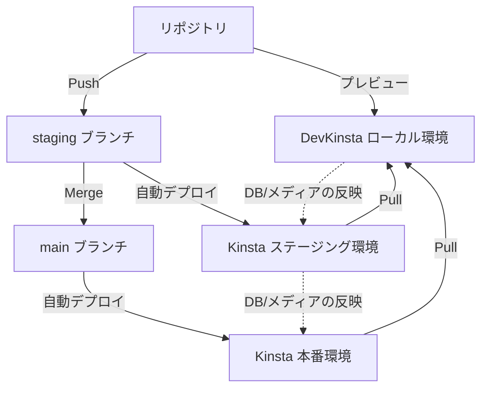
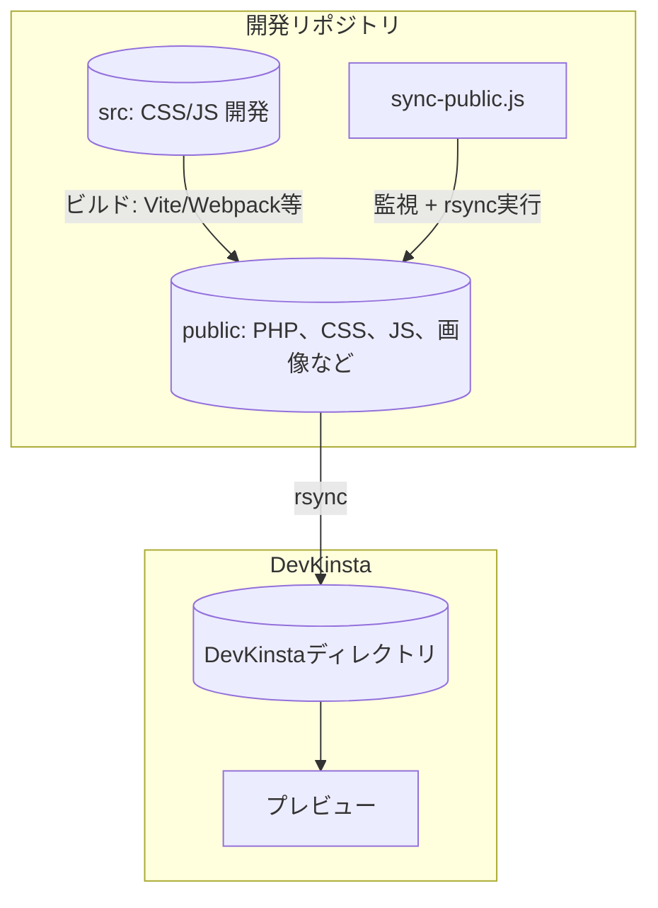

この記事は[ヌーラボブログリレー2025 冬 Tech](https://nulab.com/ja/blog/nulab/nulaber-blog-relay-2025-winter/)の15日目の記事です。

## はじめに

一年ほど前から、WordPressのホスティングに[Kinsta](https://kinsta.com/jp/wordpress-hosting/)、ローカル開発に[DevKinsta](https://kinsta.com/jp/devkinsta/)を利用しています。

これらを導入するに当たって、各ツールの強みを活かすための開発フローを構築しました。これが今のところスムーズに運用できているので、内容をまとめておこうと思います。

主なポイントは以下の2つです。

- **ローカル開発**： 開発中のWordPressテーマをDevKinstaでリアルタイムにプレビューするワークフローの構築
- **デプロイ**：開発したテーマをGitからKinstaサーバーへ自動デプロイするフローの構築

一つの記事で両方を説明すると長くなるため、それぞれ記事を分けて解説していきます。当記事では**ローカル開発**に焦点を絞って解説します。

Kinstaを前提としていますが、Kinsta以外に応用できる内容も含まれていると思います。

## 注意点

- macOSで動作確認をしていますが、Windowsでの検証はできていません。
- 主にクラシックテーマの開発を想定して執筆しています。
- 開発環境の説明を主眼としています。テーマの作り方については触れません。
- 内容の誤り、説明が不十分な箇所、より適切なアプローチがあるかもしれません。気づいたらそっと教えていただけると幸いです。

## Kinsta、DevKinstaとは

### Kinstaとは

https://kinsta.com/jp/wordpress-hosting/

[Kinsta](https://kinsta.com/jp/wordpress-hosting/)はWordPress専用のマネージドホスティングサービスです。

WordPressに関する調査をしているとKinstaのブログ記事をよく目にするので、それで存在を知った方も多いのではないでしょうか。

### DevKinstaとは

https://kinsta.com/jp/devkinsta/

[DevKinsta](https://kinsta.com/jp/devkinsta/)はKinstaが提供しているWordPressのローカル開発ツールです。類似のサービスとしては[Local](https://localwp.com/)や[WordPress Studio](https://developer.wordpress.com/ja/studio/)があります。

DevKinstaはKinstaの契約有無にかかわらず誰でも無料で利用可能です。ただしKinstaを利用している場合には、本番・ステージング環境との同期など、非常に強力な機能が使えます。

### Kinsta、DevKinstaの使用感

詳細は割愛しますが、WordPressに必要な機能がオールインワンで揃っており、どちらも非常に優れたサービスだと感じています。開発者体験も上々です。

詳しく知りたい方は、以下の解説動画がとても分かりやすいのでぜひご覧ください。

https://www.youtube.com/playlist?list=PLh6V6_7fbbo-6Wc1lFrZ14Rb9HqL2HHHF

## Kinsta + DevKinstaを利用した開発〜デプロイフローの全体像

Kinsta、DevKinstaを利用して構築したWordPress開発〜デプロイフローの全体像を示します。



1. DevKinstaを利用して、ステージング/本番環境からローカル環境にサイトをPull
1. リポジトリとDevKinstaを連携。リポジトリでテーマを開発しながらローカル環境でプレビュー。**【当記事のスコープ】**
1. stagingブランチにpush。自動でKinstaステージング環境にデプロイ
   - DBやメディアをローカルからステージングに反映したい場合はDevKinstaの「[同期](https://kinsta.com/jp/docs/devkinsta/devkinsta-integration/#mykinsta%E3%81%AE%E3%82%B9%E3%83%86%E3%83%BC%E3%82%B8%E3%83%B3%E3%82%B0%E7%92%B0%E5%A2%83%E3%81%AB%E5%A4%89%E6%9B%B4%E3%82%92%E5%8F%8D%E6%98%A0%E3%81%99%E3%82%8B)」を利用
1. mainブランチにmerge。自動でKinsta本番環境にデプロイ
   - DBやメディアをステージングから本番に反映したい場合はKinstaの「[環境の反映](https://kinsta.com/jp/docs/wordpress-hosting/wordpress-push-environments/)」を利用

:::message
当記事では2の**リポジトリとDevKinstaの連携（=ローカル開発）** に焦点を絞って解説します。

ステージング/本番へのデプロイフローについては別記事で解説する予定です。
:::

## リポジトリで開発中のWordPressテーマをDevKinstaでリアルタイムプレビューする

前置きが長くなりましたが、ここから本題に入ります。

リポジトリでテーマを開発しつつ、DevKinstaでリアルタイムプレビューするための具体的な手順を解説していきます。

## DevKinstaでは各サイト専用のディレクトリが作成される

まずはDevKinstaの仕様を確認していきましょう。

DevKinstaでは、WordPress本番環境のクローンや新規サイトを、ワンクリックでローカル上に作成することができます。


サイトを作成すると、PCのDevKinstaディレクトリ内にサイト専用のディレクトリが作成されます。
e.g., `Users/[user-name]/DevKinsta/public/[site-name]`


ディレクトリ内には、`wp-config.php`や`wp-content`など見慣れたWordPressのファイル群があります。


ここで、`wp-content/themes`にテーマディレクトリを配置すると、それらは自動で気にDevKinstaのローカル環境に読み込まれ、すぐにプレビューできます。

しかし、テーマを編集するたびに、開発リポジトリから手動でDevKinstaディレクトリにファイルをコピーするのは非常に手間がかかります。

そこで、リポジトリからDevKinstaへ自動でファイルを同期しようと考えました。

## ローカル開発の全体像：リポジトリとDevKinstaを同期する

アイデアはシンプルです。以下にローカル開発の全体像を図で示します。



1. リポジトリに`public`という名前のディレクトリを作成。DevKinstaにアップするテーマファイル（PHP、CSS、JS、画像など）を配置します。
2. ビルド・コンパイルなどの前処理が必要なファイル（CSS/JSなど）は `src`で開発し、Vite/Webpack等で `public`に出力します。
3. 独自スクリプト(`sync-public.js`)で、`public` ディレクトリの変更を監視し、変更があったらDevKinstaのディレクトリに同期（`rsync`）します。

リポジトリは以下のような構造になります。このうち`public`ディレクトリ内のファイル群がDevKinstaと同期されることになります。

```
.
├── package.json
├── src
│   ├── css
│   └── js
├── public
│   ├── .gitignore
│   └── wp-content
│       └── themes
│           └── [my-theme]
└── sync-public.js
```

## テーマ開発の方法は自由

リポジトリでのテーマの開発方法について、特に縛りはありません。

重要なのは **`public`ディレクトリに最終成果物（テーマファイル）を設置すること**です。

私の場合、CSS/JSを`src`で開発し、Viteでwatchしつつ`public`配下のテーマディレクトリに出力するようにしています。PHPや画像などは`public`内に直接配置し、編集しています。

自分の場合はこうしている、というだけなので、ここはそれぞれ好みの方法を選んで構いません。「Webpackを使いたい」「画像の一括処理をしたい」「Tailwindを使いたい」などやりたいことがあれば、そのようにセットアップして問題ありません。

重要なのは、最終的に`public` ディレクトリにサーバーへアップする全てのファイル群が出力されていることです。

## 独自スクリプトでリポジトリの変更を監視してDevKinstaに同期する

DevKinstaとの連携の肝になるのが監視・同期用の独自スクリプト（ `sync-public.js`）です。
まずは以下に完成形を記載します。

```js:sync-public.js
import 'dotenv/config'; // .env から環境変数を読み込む
import { execa } from 'execa';
import chokidar from 'chokidar';

const rsyncDestinationPath = process.env.DEV_KINSTA_PUBLIC_PATH;
if (!rsyncDestinationPath) {
  console.error('エラー: 環境変数 DEV_KINSTA_PUBLIC_PATH が設定されていません。');
  console.error('.env ファイルに DEV_KINSTA_PUBLIC_PATH=/path/to/your/devkinsta/public/project を設定してください。');
  process.exit(1);
}

const rsyncCommand = 'rsync';
const rsyncArgs = [
  '-av', // アーカイブモード（属性やパーミッションを保持）と詳細ログ出力
  '--delete', // 同期元にないファイルを削除
  '--exclude-from=public/.gitignore', // public/.gitignore で指定されたファイルを同期対象外にする
  'public/', // 同期元
  rsyncDestinationPath // 同期先
];

let isRsyncing = false; // rsync実行中フラグ

// publicディレクトリの監視
const watcher = chokidar.watch("public", {
  persistent: true, // 変更を監視し続ける
  awaitWriteFinish: {
    stabilityThreshold: 2000, // ファイルが2秒間変更されなければ「編集完了」と判定
    pollInterval: 100 // 100msごとにファイルの変更状態をチェック
  },
});

console.log('INFO: [sync-public] public ディレクトリの監視を開始しました...');

watcher.on('all', async (event, filePath) => {
  console.log(`INFO: [sync-public] イベント検知: ${event} - ${filePath || 'public directory'}`);

  if (isRsyncing) {
    console.log('INFO: [sync-public] rsync実行中のため、同期をスキップします。');
    return;
  }

  isRsyncing = true;
  console.log('INFO: [sync-public] rsync を実行します...');

  try {
    const { stdout, stderr } = await execa(rsyncCommand, rsyncArgs);
    console.log('SUCCESS: [sync-public] rsync 正常終了');
    if (stdout) console.log('stdout:\n', stdout);
    if (stderr) console.warn('stderr:\n', stderr);
  } catch (error) {
    console.error('ERROR: [sync-public] rsync 実行中にエラーが発生しました:', error.shortMessage);
    if (error.stdout) console.error('stdout:\n', error.stdout);
    if (error.stderr) console.error('stderr:\n', error.stderr);
  } finally {
    isRsyncing = false;
    console.log('INFO: [sync-public] rsync 処理完了。監視を継続します。');
  }
});
```

以下、内容について詳しく解説します。

### 利用するライブラリ

以下3つのライブラリを利用します。それぞれ `npm install` しておきます。

- `dotenv`: `.env`から環境変数を読み込む。（筆者環境ではv`17.2.0`）
- `chokidar`: ファイルの変更監視をする。（筆者環境ではv`4.0.3`）
- `execa`: `rsync`を子プロセスで実行し、ログを出力する。（筆者環境ではv`9.6.0`）

### DevKinstaディレクトリのパスを環境変数として設定する

まず、同期先となるDevKinstaのサイトディレクトリを設定する必要があります。

このパスは開発者によって異なります。そのため、チーム開発の現場では `.env` にパスを設定してもらい、環境変数として読み込む運用にしています。ディレクトリのパスはDevKinstaの設定画面で確認可能です。

```txt:.env
DEV_KINSTA_PUBLIC_PATH=/path/to/your/devkinsta/public/your-project-slug/
```


### chokidarでリポジトリ内のディレクトリを監視する

```js
// publicディレクトリの監視
const watcher = chokidar.watch("public", {
  persistent: true, // 変更を監視し続ける
  awaitWriteFinish: {
    stabilityThreshold: 2000, // ファイルが2秒間変更されなければ「編集完了」と判定
    pollInterval: 100 // 100msごとにファイルの変更状態をチェック
  },
});
```

ここでは`public`ディレクトリの監視をするwatcherを準備しています。[`chokidar`](https://github.com/paulmillr/chokidar)を使うと「**特定のディレクトリ内の変更を監視して、変更があれば処理を実行**」といったフローが簡単に設定できます。

`chokidar`の`watcher`の設定についてもう少し詳しく説明します。

#### awaitWriteFinishオプションで変更検知のタイミングを制御

chokidarの標準設定では、ファイルへの変更を検知するたびに、即座に設定した処理（ここでは`rsync`）が実行されます。つまり、ファイル編集途中に何度もrsyncが走ってしまい、

- 意図せぬタイミングでファイルがDevKinstaに同期される
- 無駄なプロセスの起動によって、パフォーマンスが低下する

といった問題が発生します。

この問題を解決するために`awaitWriteFinish`オプションを活用します。このオプションを有効にすると、ファイルの変更検知後、「ファイルの編集が落ち着いた」と判定されるまで`rsync`の実行を待機させることができます。

```js
awaitWriteFinish: {
  stabilityThreshold: 2000, // ファイルが2秒間変更されなければ「編集完了」と判定
  pollInterval: 100 // 100msごとにファイルの変更状態をチェック
}
```

つまり、ファイル編集中は同期を遅延させ、編集が完了したと判定された時点で初めて`rsync`を実行する、というフローが実現されます。

:::message
`stabilityThreshold`は長めに設定する方が「編集が終わった」という判定がより正確になりますが、その分ファイル監視の応答性は低下します。環境やニーズに応じて調整してください。
:::

### rsyncでファイルをDevKinstaに同期する

DevKinstaへのファイル同期は`rsync`が担います。`rsync`は、リモートサーバーやローカルディレクトリ間での高速なファイル同期ツールです。差分同期に対応しており、変更されたファイルのみを効率的に転送できます。

```js
const rsyncCommand = 'rsync';
const rsyncArgs = [
  '-av', // アーカイブモード（属性やパーミッションを保持）と詳細ログ出力
  '--delete', // 同期元にないファイルを削除
  '--exclude-from=public/.gitignore', // public/.gitignore で指定されたファイルを同期対象外にする
  'public/', // 同期元
  rsyncDestinationPath // 同期先
];
...

watcher.on('all', async (event, filePath) => {
  ...
  try {
    const { stdout, stderr } = await execa(rsyncCommand, rsyncArgs);
    ...
  }
});
```

ここでは、`chokidar`の`watcher`が変更を検知した際に、所定の`rsync`コマンドが実行されるように設定しています。

以下、`rsync`に関する箇所について詳しく説明します。

#### --deleteで同期元と同期先を確実に同じ状態に

`--delete`オプションを付与することで、以下の動作を実現します。

- **同期元(public)にも同期先(DevKinstaディレクトリ)にもあるファイル** → そのまま同期
- **同期元にはあるが、同期先にはないファイル** → 同期先にコピー
- **同期先にはあるが、同期元にはないファイル** → 同期先から削除

つまり、同期後には「同期元と同期先の内容が完全に同じ状態」になります。これにより、DevKinsta側に不要なファイルが蓄積されず、クリーンな状態を保てます。

#### --exclude-fromでWordPressコアファイルを維持

`--exclude-from=public/.gitignore`は、DevKinstaディレクトリに存在するWordPressのコアファイル（`wp-admin`、`wp-config.php`など）を削除対象から除外します。

詳しくはこの後の[.gitignoreでWordPressコアファイルを管理対象から外す](#.gitignoreでwordpressコアファイルを管理対象から外す)で解説します。

#### isRsyncingフラグでrsyncの多重起動を防止

ファイル更新が頻繁に発生する場合、特に対策をしなければ、複数の`rsync`プロセスが同時に実行され、

- パフォーマンスの低下
- 実行ログの大量出力

といった問題が発生します。

これを防ぐため、`isRsyncing`というフラグを用意し、同期の実行中は追加の`rsync`プロセスが起動されないようにしています。

```js
let isRsyncing = false; // rsync実行中フラグ

watcher.on('all', async (event, filePath) => {
  if (isRsyncing) {
    console.log('INFO: [sync-public] rsync実行中のため、同期をスキップします。');
    return;
  }

  isRsyncing = true;
  console.log('INFO: [sync-public] rsync を実行します...');

  try {
    const { stdout, stderr } = await execa(rsyncCommand, rsyncArgs);
  } catch (error) {
    ...
  } finally {
    isRsyncing = false;
    console.log('INFO: [sync-public] rsync 処理完了。監視を継続します。');
  }
});
```

### .gitignoreでWordPressコアファイルを管理対象から外す

[前述](#--deleteで同期元と同期先を確実に同じ状態に)の通り、rsync実行時には`--delete`オプションを付与しています。

ただし、DevKinstaディレクトリには、リポジトリで開発しているテーマ以外にもWPのコアファイルが存在しています。これらを除外対象としておかなければ、`rsync`がテーマ以外のファイルをすべて削除してしまい、ローカル環境が壊れてしまいます。

そのため、`public/.gitignore` を利用して、テーマ以外のファイルをrsyncの同期対象から外しています。これも[前述](#--exclude-fromでwordpressコアファイルを維持)の通りです。

実際の`public/.gitignore`の内容は以下のようになっています。[WordPress.gitignore](https://github.com/github/gitignore/blob/main/WordPress.gitignore)をベースにしつつ一部調整を加えました。

```:public/.gitignore
# Wordpress - ignore core, configuration, examples, uploads and logs.
# https://github.com/github/gitignore/blob/main/WordPress.gitignore

# Core
#
# Note: if you want to stage/commit WP core files
# you can delete this whole section/until Configuration.
wp-admin/
wp-content/index.php
wp-content/languages
wp-content/plugins/index.php
wp-content/themes/index.php
wp-includes/
index.php
license.txt
readme.html
wp-*.php
xmlrpc.php
.htaccess

# Configuration
wp-config.php

# Example themes
wp-content/themes/twenty*/

# Uploads
wp-content/uploads/
wp-content/uploads-webpc/

# Upgrade Directory (usually temporary)
wp-content/upgrade/

# Log files
*.log
*.log*

# All plugins
#
# Note: If you wish to whitelist plugins,
# uncomment the next line
wp-content/plugins
wp-content/mu-plugins

# DevKinsta Files
dup-*
```

これによってWPの動作に必要なファイル群を維持しつつ、開発中のテーマだけを確実に同期することが可能になります。

:::message
ファイル内のコメントにもある通り、プラグインを開発している場合など、状況やニーズに応じて内容を調整してください。
:::

## src開発/監視/同期をまとめて実行するコマンドを準備する

ここまでで監視・同期用のスクリプトが作成できました。最後にこのスクリプトを実行するコマンドを準備します。

```json:package.json
{
  "scripts": {
    "sync": "node sync-public.js",
  }
}
```

さらに、既存の開発コマンド（Vite等）と組み合わせて、srcでの開発・ビルド・DevKinstaへの同期をまとめて実行するコマンドを作成します。

```js:package.json
{
  "scripts": {
    "dev": "run -p dev:vite sync",
    "dev:vite": "vite",
    "sync": "node sync-public.js",
  },
}
```

:::message
並列実行のため、[npm-run-all2](https://www.npmjs.com/package/npm-run-all) というライブラリを利用しています。
:::

この状態で

```sh
npm run dev
```

を実行すれば、リポジトリでテーマを開発（srcをwatchしてpublicへビルド）しつつDevKinstaにも自動で同期（publicとDevKinstaのディレクトリを同期）する開発環境が立ち上がります。

以下に再度ローカル開発の全体像を掲載しておきます。


## まとめ

いかがだったでしょうか。DevKinstaは単独でも非常に便利ですが、今回のようにリポジトリと連携することでより効率的に利用することが出来ます。

この記事がWordPress開発フローに悩んでいるみなさまの参考になれば幸いです。

次の記事ではこの構成で開発したテーマを、Gitを利用してKinstaサーバーに自動デプロイするフローについて解説する予定です。
